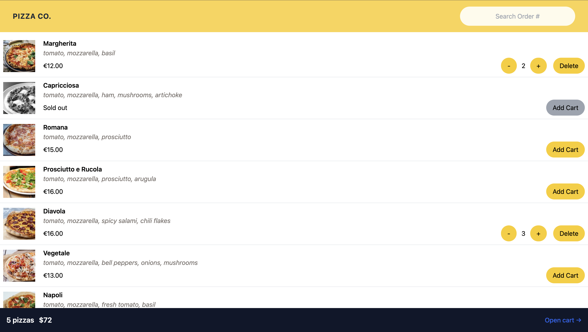

# PizzaShop

React Pizza, kullanıcıların çevrimiçi olarak pizza siparişi verebileceği modern bir web uygulamasıdır. Proje, React ve Vite kullanılarak geliştirilmiş olup, state yönetimi için Redux Toolkit, yönlendirme için React Router ve stilleme için TailwindCSS kullanmaktadır.

## Özellikler
- 🍕 Pizza çeşitlerini listeleme
- 🛒 Sepete ekleme ve çıkarma
- 💳 Sipariş tamamlama
- 🚀 Hızlı ve optimize edilmiş kullanıcı deneyimi

## Kullanılan Teknolojiler
- **React**: Modern UI bileşenleri oluşturmak için
- **Vite**: Hızlı geliştirme ortamı
- **Redux Toolkit**: Global state yönetimi
- **React Router**: Sayfa yönlendirme
- **TailwindCSS**: Hızlı ve esnek stil oluşturma
- **ESLint & Prettier**: Kod kalitesini sağlamak için

## Kurulum
Projeyi yerel ortamınıza klonladıktan sonra aşağıdaki adımları takip edebilirsiniz:

### 1. Depoyu klonlayın:
```sh
git clone https://github.com/kullaniciadi/react-pizza.git
cd react-pizza
```

### 2. Bağımlılıkları yükleyin:
```sh
npm install
```

### 3. Geliştirme modunda çalıştırın:
```sh
npm run dev
```

### 4. Üretim için build alın:
```sh
npm run build
```

### 5. Üretim build’ini önizleyin:
```sh
npm run preview
```


